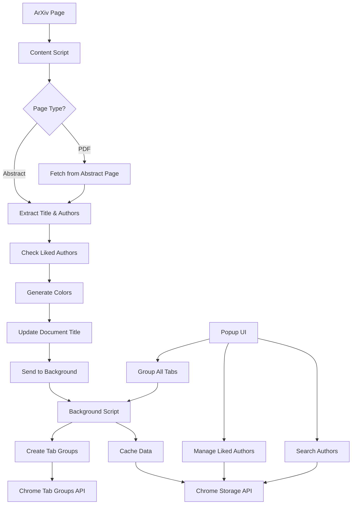

# ArXiv Tab Enhancer

🚀 **A powerful Chrome extension that transforms your ArXiv browsing experience**

Turn chaotic numbered tabs into organized, color-coded groups with meaningful titles and intelligent author-based organization.

## The Problem We Solve

**Before:** Opening multiple ArXiv papers results in a mess of identical-looking tabs showing only paper IDs like "2501.00123", "1706.03762", making it impossible to distinguish between different papers or find specific research.

**After:** Clean, organized tabs with meaningful titles, author names, categories, and automatic grouping by author with consistent colors.

---

## 🌟 Key Features

### 📝 **Smart Title Enhancement**
- **Automatic Title Replacement**: Transforms generic IDs into readable paper titles
- **Author Integration**: Shows first author name in tab title (e.g., "Vaswani: Attention Is All You Need")
- **Category Prefixes**: Adds field indicators like `[cs]`, `[math]`, `[physics]`
- **Smart Truncation**: Intelligently shortens long titles to fit browser tabs

### 🎨 **Visual Organization** 
- **Author-Based Colors**: Consistent color coding for papers by the same author
- **Smart Tab Grouping**: Automatically groups papers using Chrome's Tab Groups API
- **Color Persistence**: Same author = same color across browser sessions
- **Visual Hierarchy**: Easy to spot related work at a glance

### ⭐ **Liked Authors Priority**
- **Priority Grouping**: Add favorite authors to get priority grouping even when not first author
- **Flexible Matching**: "Smith" matches "John Smith", "Smith, J.", etc.
- **Management UI**: Easy add/remove interface with green tags
- **Smart Detection**: Finds liked authors in any position in author list

### 🔍 **Advanced Search & Navigation**
- **Author Search**: Search and filter through cached papers by author name
- **Quick Navigation**: Click author names to jump to their papers
- **Paper Statistics**: View cached papers count and active author groups
- **Memory Management**: Intelligent caching with automatic cleanup

### 🛠 **Technical Excellence**
- **PDF Page Support**: Works seamlessly on both abstract (`/abs/`) and PDF (`/pdf/`) pages
- **Automatic Data Fetching**: PDF pages automatically fetch metadata from abstract pages
- **Cross-Page Caching**: Data persists between abstract and PDF views
- **Error Handling**: Robust fallbacks for network issues or parsing failures

## Installation

### From Source (Recommended for Development)

1. Clone this repository:
   ```bash
   git clone https://github.com/urikreitner/arxiv-tab-enhancer.git
   cd arxiv-tab-enhancer
   ```

2. Open Chrome and navigate to `chrome://extensions/`

3. Enable "Developer mode" (toggle in top right)

4. Click "Load unpacked" and select the extension directory

5. The extension should now be active for ArXiv pages

### From Chrome Web Store

*Coming soon - extension will be published to the Chrome Web Store after testing*

## Usage

1. **Automatic Operation**: Once installed, the extension automatically works on ArXiv pages
2. **Tab Grouping**: Papers by the same author are automatically grouped with consistent colors
3. **Author Search**: Use the search box in the popup to find papers by specific authors
4. **Manual Refresh**: Click "Refresh Current Tab" to force an update
5. **Group All Tabs**: Use "Group All ArXiv Tabs" to organize all open ArXiv papers
6. **View Stats**: The popup shows cached papers, memory usage, and active author groups
7. **Clear Cache**: Clear stored paper data when needed

## How It Works

1. **Content Script**: Detects ArXiv pages and extracts paper metadata (title, authors, category)
2. **Author Processing**: Parses author lists and identifies the first author for organization
3. **Color Generation**: Creates consistent colors for each author using hash-based algorithm
4. **Tab Grouping**: Uses Chrome's Tab Groups API to organize papers by author
5. **Background Script**: Manages tab titles, grouping, and caching
6. **Smart Formatting**: Truncates long titles and adds author names and category prefixes

## 📊 Visual Examples

### Tab Title Transformation
```
BEFORE: 2501.00123 - arXiv.org
AFTER:  [cs] Vaswani: Attention Is All You Need: A Survey of...
        └─ Category  └─ Author  └─ Paper Title (truncated)
```

### Tab Grouping in Action
```
🔵 Vaswani Group (3 papers)
├── [cs] Vaswani: Attention Is All You Need
├── [cs] Vaswani: BERT: Pre-training of Deep Bidirectional...
└── [cs] Vaswani: Language Models are Few-Shot Learners

🟢 Smith Group (2 papers)  
├── [math] Smith: On the Convergence of Stochastic...
└── [stat] Smith: Statistical Learning Theory and...

🟡 Individual Papers
├── [physics] Anderson: Quantum Mechanics and...
└── [bio] Johnson: CRISPR Gene Editing Applications...
```

### Liked Authors Priority
```
Author List: "Alice Johnson, Bob Smith, Carol Davis"
Liked Authors: ["Smith"]
Result: Groups under "Smith" (not "Johnson")
```

### Search & Navigation
- **Search "Vaswani"** → Shows all papers + paper count
- **Click author** → Jumps to first tab by that author
- **Green tags** → Manage liked authors with × to remove

## Development

### Prerequisites

- Python 3.8+ (for icon generation)
- Chrome browser
- Git

### Setup Development Environment

1. Create Python virtual environment:
   ```bash
   python3 -m venv venv
   source venv/bin/activate
   ```

2. Install dependencies:
   ```bash
   pip install -r requirements.txt
   ```

3. Generate icons (if needed):
   ```bash
   python3 create_icons.py
   ```

### Project Structure

```
arxiv-tab-enhancer/
├── 📄 manifest.json              # Extension manifest (entry point)
├── 📁 src/                       # Core JavaScript modules
│   ├── 🎯 content.js            # Content script - extracts paper data from ArXiv pages
│   ├── ⚙️  background.js         # Background service worker - manages grouping & caching  
│   └── 🎮 popup.js              # Popup interface - handles UI interactions
├── 🖼️  popup.html               # Extension popup UI with liked authors management
├── 📁 icons/                    # Extension icons (multiple sizes)
│   ├── icon16.png              # 16x16 browser icon
│   ├── icon48.png              # 48x48 extension page icon  
│   └── icon128.png             # 128x128 store icon
├── 🐍 create_icons.py           # Python script for generating icons
├── 📋 requirements.txt          # Python dependencies (Pillow for icon generation)
├── 📝 CLAUDE.md                 # Development guidelines and workflow
├── 🚫 .gitignore                # Git ignore rules (excludes venv/, cache, etc.)
└── 📖 README.md                 # This comprehensive documentation
```

### Architecture Overview



### Key Components Explained

#### 🎯 **Content Script** (`src/content.js`)
- **Runs on**: All ArXiv pages (`/abs/` and `/pdf/`)
- **Responsibilities**: 
  - Extract paper metadata (title, authors, category)
  - Handle PDF pages by fetching abstract page data
  - Check liked authors for priority grouping
  - Generate consistent author colors
  - Update document title directly
- **Key Methods**: `extractPaperInfo()`, `getPreferredAuthor()`, `fetchAbstractPageData()`

#### ⚙️ **Background Script** (`src/background.js`)  
- **Type**: Service Worker (Manifest V3)
- **Responsibilities**:
  - Manage Chrome Tab Groups API
  - Handle author-based grouping logic
  - Cache paper data in Chrome Storage
  - Clean up empty groups when tabs close
- **Key Methods**: `manageAuthorGrouping()`, `createAuthorGroup()`, `handleTabRemoval()`

#### 🎮 **Popup Interface** (`popup.html` + `src/popup.js`)
- **Responsibilities**:
  - Manage liked authors list with add/remove UI
  - Search through cached papers by author
  - Display extension statistics
  - Manual tab grouping controls
- **Key Features**: Green tag UI for liked authors, real-time search, paper counts

### Testing

To test the extension:

1. Load the extension in Chrome (see Installation section)
2. Visit any ArXiv paper page (e.g., `https://arxiv.org/abs/2301.00001`)
3. Check that the tab title updates with the paper title
4. Test with both abstract pages (`/abs/`) and PDF pages (`/pdf/`)
5. Verify the popup interface works correctly

## Contributing

1. Fork the repository
2. Create a feature branch (`git checkout -b feature/amazing-feature`)
3. Commit your changes (`git commit -m 'Add amazing feature'`)
4. Push to the branch (`git push origin feature/amazing-feature`)
5. Open a Pull Request

## Privacy

This extension:
- ✅ Only runs on ArXiv domains (`arxiv.org`)
- ✅ Stores data locally in your browser
- ✅ Does not transmit any data to external servers
- ✅ Only accesses paper metadata that's already public on ArXiv

## Permissions

The extension requires these permissions:
- `tabs`: To update tab titles and query open tabs
- `tabGroups`: To create and manage tab groups by author
- `activeTab`: To access the current ArXiv page content
- `storage`: To cache paper metadata locally
- `host_permissions` for `arxiv.org`: To run on ArXiv pages only

## License

MIT License - see the [LICENSE](LICENSE) file for details.

## Changelog

### v1.1.0 (2025-02-02)
- Added author-based tab grouping with Chrome Tab Groups API
- Implemented consistent color coding for papers by the same author
- Added author search and filtering in popup interface
- Enhanced tab titles to include first author names
- Improved popup UI with author statistics and grouping controls
- Added automatic cleanup of empty tab groups

### v1.0.0 (2025-02-01)
- Initial release
- Basic title replacement functionality
- Support for abstract and PDF pages
- Popup interface with stats and controls
- Paper metadata caching system